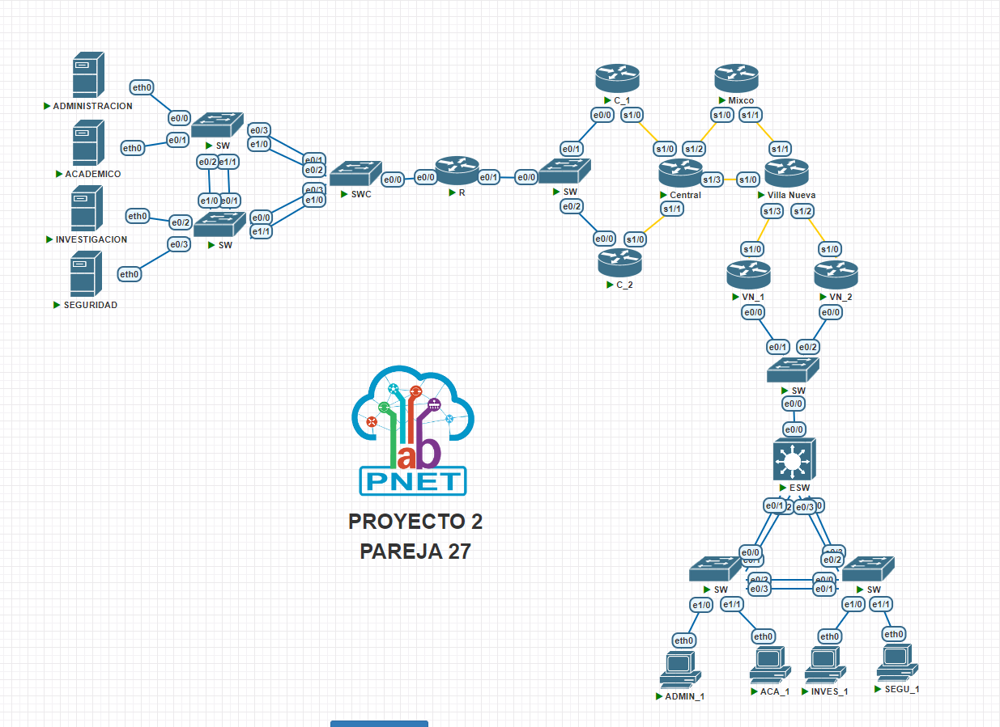

# Manual Técnico

## Sección 1: Navegando por las Direcciones IP 🖧

| Dispositivo ⚙️ | Direccion IP 🔍| Mascara de subred 🎭 | Puerta de enlace 🔗 |VLAN 📡|
|----------|------------|-----------------|-----------------|--------------|
| 🖥️ ACADEMICO | 172.127.2.1 | 255.255.255.224 | 172.127.2.30 | VLAN 127 |
| 🖥️ INVESTIGACION | 172.127.2.33 | 255.255.255.240 | 172.127.2.46 | VLAN 227 |
| 🖥️ ADMINISTRACION | 172.127.2.49 | 255.255.255.240 | 172.127.2.62 | VLAN 327 |
| 🖥️ SEGURIDAD | 172.127.2.65 | 255.255.255.248 | 172.127.2.70 | VLAN 427 |
| 💻 ACA_1 | 173.127.2.1 | 255.255.255.224 | 173.127.2.30 | VLAN 327 |
| 💻 SEGU_1 | 173.127.2.33 | 255.255.255.240 | 173.127.2.46 | VLAN 227 |
| 💻 INVES_1 | 173.127.2.49 | 255.255.255.240 | 173.127.2.62 | VLAN 527 |
| 💻 ADMIN_1 | 173.127.2.65 | 255.255.255.248 | 173.127.2.70 | VLAN 127 |

## Seccion 2: Redes

### Redes VLSM de Central

| Subred   | Nº de Hosts | ID de Red       | IP de red        | Máscara         | Primer Host   | Último Host   | Broadcast     | Puerta de enlace  |
|----------|------------|-----------------|-----------------|-----------------|--------------|--------------|--------------|-------------------|
| ACADEMICO | 30         | 172.127.2.0     | 172.127.2.0 /27 | 255.255.255.224 | 172.127.2.1  | 172.127.2.30 | 172.127.2.31 | 172.127.2.1       |
| INVESTIGACION | 14         | 172.127.2.32    | 172.127.2.32 /28| 255.255.255.240 | 172.127.2.33 | 172.127.2.46 | 172.127.2.47 | 172.127.2.33      |
| ADMINISTRACION | 14         | 172.127.2.48    | 172.127.2.48 /28| 255.255.255.240 | 172.127.2.49 | 172.127.2.62 | 172.127.2.63 | 172.127.2.49      |
| SEGURIDAD | 6          | 172.127.2.64    | 172.127.2.64 /29| 255.255.255.248 | 172.127.2.65 | 172.127.2.70 | 172.127.2.71 | 172.127.2.65      |

### Redes VLSM de Villa Nueva

| Subred   | Nº de Hosts | ID de Red       | IP de red        | Máscara         | Primer Host   | Último Host   | Broadcast     | Puerta de enlace  |
|----------|------------|-----------------|-----------------|-----------------|--------------|--------------|--------------|-------------------|
| ACADEMICO | 30         | 173.127.2.0     | 173.127.2.0 /27 | 255.255.255.224 | 173.127.2.1  | 173.127.2.30 | 173.127.2.31 | 173.127.2.1       |
| SEGURIDAD | 14         | 173.127.2.32    | 173.127.2.32 /28| 255.255.255.240 | 173.127.2.33 | 173.127.2.46 | 173.127.2.47 | 173.127.2.33      |
| INVESTIGACION | 14         | 173.127.2.48    | 173.127.2.48 /28| 255.255.255.240 | 173.127.2.49 | 173.127.2.62 | 173.127.2.63 | 173.127.2.49      |
| ADMINISTRACION | 6          | 173.127.2.64    | 173.127.2.64 /29| 255.255.255.248 | 173.127.2.65 | 173.127.2.70 | 173.127.2.71 | 173.127.2.65      |

## Sección 3: Calculo de VLSM de Central

- Ejemplo de calculo de la subred ACADEMICO

- Número de Hosts: Según la tabla, se necesitan 30 hosts en esta subred.
    - ID de Red: Ya está proporcionado en la tabla, es "172.127.2.0".
    - IP de Red: También está en la tabla, es "172.127.2.0/27", lo que significa que los primeros 27 bits están reservados para la red.
    - Máscara: La máscara de subred es "255.255.255.224", que en notación CIDR es "/27".
    - Primer Host: Para calcularlo, sumamos 1 a la dirección de red: 172.127.2.0 + 1 = 172.127.2.1
    - Entonces, el primer host en esta subred es "172.127.2.1".
    - Último Host: Para calcularlo, restamos 1 al broadcast:
    - Broadcast: 172.127.2.31
    - Último Host: 172.127.2.31 - 1 = 172.127.2.30
    - El último host en esta subred es "172.127.2.30".
    - Broadcast: El broadcast para esta subred es "172.127.2.31".
    - Puerta de enlace: Por convención, la puerta de enlace suele ser la primera dirección IP de la subred, que es el "Primer Host". Entonces, la puerta de enlace es "172.127.2.1".

- Este procedimiento se repite en cada subred

- Obtenemos como reusltado lo siguiente:

- ACADEMICO:
    - Número de Hosts: 30
    - ID de Red: 172.127.2.0
    - IP de Red: 172.127.2.0/27
    - Máscara: 255.255.255.224
    - Primer Host: 172.127.2.1
    - Último Host: 172.127.2.30
    - Broadcast: 172.127.2.31
    - Puerta de enlace: 172.127.2.1

- INVESTIGACION:
    - Número de Hosts: 14
    - ID de Red: 172.127.2.32
    - IP de Red: 172.127.2.32/28
    - Máscara: 255.255.255.240
    - Primer Host: 172.127.2.33
    - Último Host: 172.127.2.46
    - Broadcast: 172.127.2.47
    - Puerta de enlace: 172.127.2.33

- ADMINISTRACION:
    - Número de Hosts: 14
    - ID de Red: 172.127.2.48
    - IP de Red: 172.127.2.48/28
    - Máscara: 255.255.255.240
    - Primer Host: 172.127.2.49
    - Último Host: 172.127.2.62
    - Broadcast: 172.127.2.63
    - Puerta de enlace: 172.127.2.49

- SEGURIDAD:
    - Número de Hosts: 6
    - ID de Red: 172.127.2.64
    - IP de Red: 172.127.2.64/29
    - Máscara: 255.255.255.248
    - Primer Host: 172.127.2.65
    - Último Host: 172.127.2.70
    - Broadcast: 172.127.2.71
    - Puerta de enlace: 172.127.2.65

## Sección 4 : Topologia Implementada 🚀

