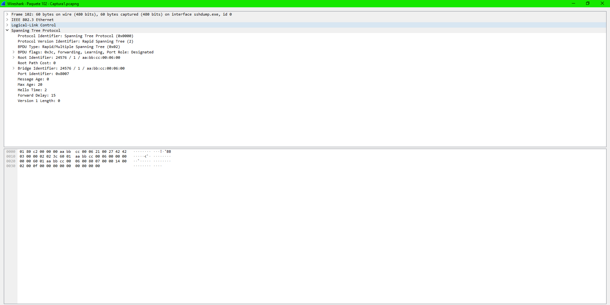

# Manual Técnico

## Sección 1: Navegando por las Direcciones IP 🖧

#### Tabla descriptiva de dispositivos de red:

|Dispositivo ⚙️|Dirección IP 🔍|Puerta de enlace predeterminada 🔗|Máscara de Subred 🎭|VLAN 📡|
|----|:----:|:----:|:----:|----|
|🖥️ ADMINISTRACION|172.16.28.2|172.16.28.1|255.255.255.0|VLAN 127|
|💻 ADM 1|192.16.28.3|172.16.28.1|255.255.255.0|VLAN 127|
|💻 ADM 2|192.16.28.4|172.16.28.1|255.255.255.0|VLAN 127|
|🖥️ ACADEMICO|172.16.29.2|172.16.29.1|255.255.255.0|VLAN 227|
|💻 ACA 1|192.16.29.3|172.16.29.1|255.255.255.0|VLAN 227|
|💻 ACA 2|192.16.29.4|172.16.29.1|255.255.255.0|VLAN 227|
|🖥️ INVESTIGACION|172.16.30.2|172.16.30.1|255.255.255.0|VLAN 327|
|💻 ACA 1|192.16.30.3|172.16.30.1|255.255.255.0|VLAN 327|
|💻 ACA 2|192.16.30.4|172.16.30.1|255.255.255.0|VLAN 327|
|🖥️ SEGURIDAD|172.16.31.2|172.16.31.1|255.255.255.0|VLAN 427|
|💻 ACA 1|192.16.31.3|172.16.31.1|255.255.255.0|VLAN 427|
|💻 ACA 2|192.16.31.4|172.16.31.1|255.255.255.0|VLAN 427|

## Sección 2: Topologia Implementada 🚀

## Sección 3: Comandos ⌨️

### Comandos Utilizados - Switch ESW1 🎛️

##### Configuracion de Puertos

- interface range e0/0-3
    - switchport trunk encapsulation dot1q
    - switchport mode trunk
    - switchport trunk native vlan 99

- interface range e1/0-2
    - switchport trunk encapsulation dot1q
    - switchport mode trunk
    - switchport trunk native vlan 99

- interface e1/3
    - switchport mode access
    - switchport access vlan 999

##### Configuracion de VLANs

- vlan 127
    - name ADMINISTRACION

- vlan 227
    - name ACADEMICO

- vlan 327
    - name INVESTIGACION

- vlan 427
    - name SEGURIDAD

- vlan 99
    - name NATIVE

- vlan 999
    - name BLACKHOLE

##### Configuracion de VTPs

- vtp mode Server
- vtp domain pareja27
- vtp password usac
- vtp version 2

##### Configuracion de Spannig-Tree

- spannig-tree mode rapid-pvst
    - -> switch principal <-
    - spanning-tree vlan 99,127,227,327,427,999 root primary
    

### Comandos Utilizados - Switch SW5 🎛️

##### Configuracion de Puertos

- interface range e0/0-1
    - switchport trunk encapsulation dot1q
    - switchport mode trunk
    - switchport trunk native vlan 99

- interface range e1/0-2
    - switchport trunk encapsulation dot1q
    - switchport mode trunk
    - switchport trunk native vlan 99

- interface e0/2
    - switchport mode access
    - switchport mode access vlan 427

- interface e0/3
    - switchport mode access
    - switchport mode access vlan 227

##### Configuracion de VTPs

- vtp mode Client
- vtp domain pareja27
- vtp password usac

##### Configuracion de Spannig-Tree

- spannig-tree mode rapid-pvst

### Comandos Utilizados - Switch SW 🎛️

##### Configuracion de Puertos

- interface range e0/0-1
    - switchport trunk encapsulation dot1q
    - switchport mode trunk
    - switchport trunk native vlan 99

- interface range e1/0-2
    - switchport trunk encapsulation dot1q
    - switchport mode trunk
    - switchport trunk native vlan 99

- interface e0/2
    - switchport mode access
    - switchport mode access vlan 127

- interface e0/3
    - switchport mode access
    - switchport mode access vlan 427

- interface e1/0
    - switchport mode access
    - switchport mode access vlan 227

- interface e1/1
    - switchport mode access
    - switchport mode access vlan 327

- interface e1/2-3
    - switchport mode access
    - switchport mode access vlan 999

##### Configuracion de VTPs

- vtp mode Client
- vtp domain pareja27
- vtp password usac

##### Configuracion de Spannig-Tree

- spannig-tree mode rapid-pvst

## Sección 4: Capturas de Wireshark 🦈

#### Captura 1 - VLANS:

#### Captura 2 - Spanning-Tree:

